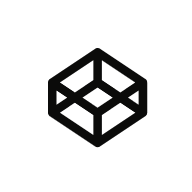

### Hello there 👋 I'm Rob 😀

### A ✨creativity ✨ minded frontend developer 
### Creativity is the best way to solve problems and find new ways for better sollutions

- I´m a _developer_ with focus on _creating smart user interfaces & useful interactions_

- developing rich web experiences & applications

- I like both logic and design

# Education

I'm currently studying _Frontend / App Development_ at [Changemaker Educations](https://cmeducations.se/utbildningar/program/frontend-app-developer) (2022-2024)
 
I'm currently doing an internship at [Degaming](https://degaming.io/)

## This is some of my favorite tech I often use

  
  
  
   
  

 
  
   
   
  
  

## Additional tech & some I worked with in projects

 
  
  
  
  
  
  
  

   
   
   
   
   
   
       
   

 
  

  

# Work

Currently working as an intern at DeGamingGroup
2 freelance projects using sanity as cms and NEXT with framer-motion for MBA and LockerLegends
Freelance project for Danscenter Fryshuset a communication app for the school
Worked at Addcode in fall/spring 2022 
Upcoming wordpress website for and under the lead of Dans.se
Done prototyping for a few startups and upcoming projects thru CME Swipe-north and Jolint

## 🚀 I'm always on the lookout and trying to stay up-to-date on the latest trends.

💻 The goal is to become a fulltime developer.
With the constant evolution in technology, I believe that this is the right field to work in.
It is important to stay ahead of the curve in order to deliver the best possible sollutions for the clients.

🚀 LinkedIn Skill Assessments in HTML, CSS, JAVASCRIPT, REACT & FRONTEND-DEVELOPMENT - 🤓

### What I love doing (besides coding)

- Family time 🥰
- Drink a good cup of ☕ or tea
- Dance my passion goes deep with the artform of Locking & Hip-Hop 🕺

### Have and Idea you want to bring to life?

- 💬 Reach out and lets have a chat?

### You can find me at:

#### You can reach me at:

✉️ robertwagar@gmail.com
